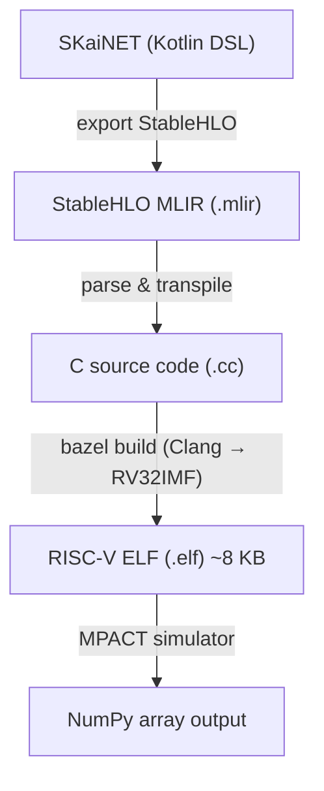

# SKaiNET-embedded

End-to-end compilation and execution pipeline for deploying machine learning models on Google's Coral Neural Processing Unit (NPU).

## Overview

SKaiNET-embedded bridges three technology stacks to take ML models from a high-level Kotlin DSL all the way to bare-metal execution on the Coral NPU:

1. **SKaiNET** (Kotlin Multiplatform) — Type-safe tensor DSL and model definition
2. **iree-tools** (Python) — StableHLO MLIR parser and C code transpiler
3. **coralnpu** (Bazel toolchain) — RISC-V cross-compiler and MPACT simulator



## Project Structure

```
SKaiNET-embedded/
├── coralnpu/
│   ├── docs/                  # Antora documentation (AsciiDoc, Diataxis framework)
│   └── iree-tools/            # Python transpilation pipeline
│       ├── main.py            # CLI entry point (compile, verify, generate-c, build-elf, simulate, run-all)
│       ├── mlir_parser.py     # Regex-based StableHLO MLIR parser
│       ├── codegen.py         # IR → C code generator
│       ├── bazel_builder.py   # Bazel integration for cross-compilation
│       ├── simulator.py       # MPACT simulator driver
│       └── rgb2grayscale.mlir # Example model
└── LICENSE
```

## Quick Start

### Prerequisites

- Python 3.13+ with [uv](https://docs.astral.sh/uv/)
- Bazel 7.4.1
- Clang 19 (RV32 cross-compilation)
- JDK + Gradle (for SKaiNET model export)

### Run the Example

The canonical example is an RGB-to-grayscale converter (1x1 convolution with weights `[0.2989, 0.587, 0.114]`).

```bash
# Transpile, build, and simulate in one step
cd coralnpu/iree-tools
uv run python main.py run-all rgb2grayscale.mlir
```

Or run each stage individually:

```bash
# 1. Generate C code from MLIR
uv run python main.py generate-c rgb2grayscale.mlir

# 2. Build ELF for Coral NPU
uv run python main.py build-elf rgb2grayscale.mlir

# 3. Run on MPACT simulator
uv run python main.py simulate rgb2grayscale.mlir

# Optional: verify against IREE host reference
uv run python main.py verify rgb2grayscale.mlir
```

## Coral NPU Target

| Property | Value |
|----------|-------|
| ISA | RV32IMF + Zve32x (128-bit SIMD), Zicsr, Zifencei, Zbb |
| ABI | ilp32 |
| ITCM | 8 KB (code + constants) |
| DTCM | 32 KB (data + stack) |
| EXTMEM | 4 MB |
| Simulator | MPACT (behavioral) / Verilator (cycle-accurate) |

## Supported StableHLO Operations

- `stablehlo.constant` — Dense tensor constants (f16, f32, i32)
- `stablehlo.convert` — Type conversions
- `stablehlo.convolution` — General and optimized 1x1 convolutions
- `stablehlo.add`, `multiply`, `subtract`, `divide` — Element-wise binary ops

## Documentation

Full documentation is built with [Antora](https://antora.org/) using the Diataxis framework:

```bash
cd coralnpu
docker compose up
# Browse to http://localhost:8080
```

Topics covered: architecture overview, Coral NPU hardware, DSL-to-NPU pipeline, optimization passes, step-by-step tutorials, and CLI reference.

## The Gap

The Coral NPU IREE compiler plugin is not available in the open-source release. This project provides a pragmatic workaround by transpiling StableHLO directly to C, bypassing the missing plugin. See the [architecture docs](coralnpu/docs/modules/explanation/pages/the-gap.adoc) for details.

## License

[MIT](LICENSE)
