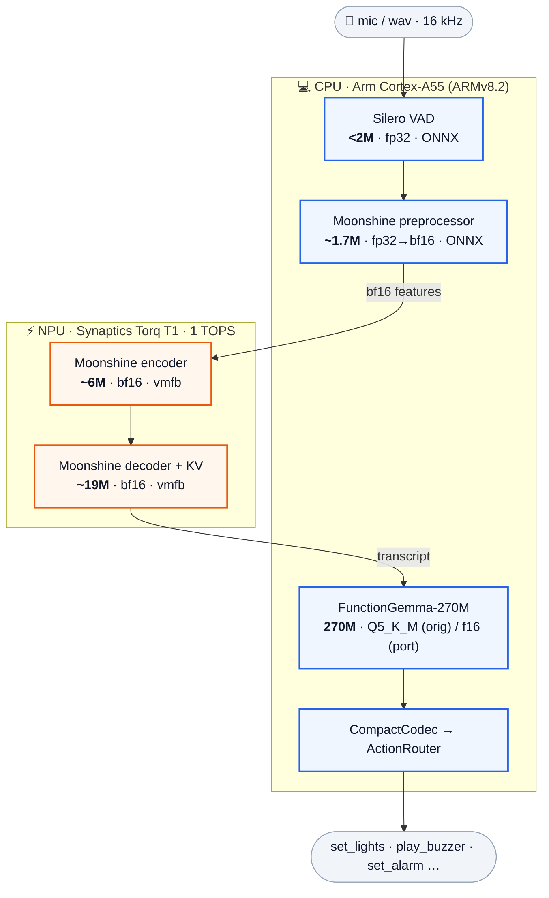

# SL2610 voice → tool-call pipeline — what runs where

On-device, cloud-free. Two compute units do the heavy lifting:

- **CPU** — 1–2× Arm **Cortex-A55** (ARMv8.2-A: NEON, fp16, dotprod; no i8mm)
- **NPU** — Synaptics **Torq T1** (1 TOPS, dual 256-MAC; INT8 / INT16 / **BF16**, transformer-capable)

The placement matches the original Synaptics `Function_calling` example: **ASR → NPU, LLM → CPU**.

> A rendered infographic (for slides/management) is in [`pipeline.svg`](pipeline.svg).

## Pipeline (Mermaid)



## Pipeline (flow + placement + size + dtype)

```
  🎤 mic / wav  (16 kHz PCM mono)
        │
        ▼
  ┌─ Silero VAD ───────────────────── CPU (A55) ─┐   speech segmentation
  │  ~1.8 MB (<2M params) · fp32 · ONNX           │   → one WAV per utterance
  └──────────────────────────────────────────────┘
        │  utterance audio
        ▼
  ┌─ Moonshine preprocessor ───────── CPU (A55) ─┐   conv front-end
  │  ~1.7M params · fp32 → bf16 · ONNX            │   raw audio → [1,288,frames] bf16
  └──────────────────────────────────────────────┘
        │  bf16 features
        ▼
  ╔═ Moonshine encoder ═════════════ NPU (Torq) ═╗  ⚡ transformer encoder
  ║  ~6M params · bf16 · prebuilt vmfb            ║
  ╚══════════════════════════════════════════════╝
        │
        ▼
  ╔═ Moonshine decoder (+ KV-cache) ═ NPU (Torq) ═╗  ⚡ autoregressive decode
  ║  ~19M params · bf16 · prebuilt vmfb           ║  decoder + decoder_with_past
  ╚══════════════════════════════════════════════╝
        │  transcript text
        ▼
  ┌─ FunctionGemma-270M ───────────── CPU (A55) ─┐   LLM tool-router (functional tokens)
  │  270M params                                  │   text → <tool_N>(args)
  │  Q5_K_M  (original, llama.cpp)                 │
  │  f16 vmfb (our port, IREE)                    │
  └──────────────────────────────────────────────┘
        │  tool call
        ▼
  ┌─ CompactCodec → ActionRouter ──── CPU (A55) ─┐
  │  — · Kotlin                                   │   <tool_0>(state="on") → set_lights(on)
  └──────────────────────────────────────────────┘

  ASR (Moonshine tiny) ≈ 27M params total · LLM (FunctionGemma) = 270M params
```

## Breakdown table

| Stage | Component | Unit | Params | dtype | Runtime / format |
|---|---|---|---:|---|---|
| 1 | **Silero VAD** | CPU A55 | ~1.8 MB (<2M) | fp32 | ONNX (`silero_vad_notorch`) |
| 2 | **Moonshine preprocessor** (conv frontend) | CPU A55 | ~1.7M | fp32 → bf16 | ONNX |
| 3 | **Moonshine encoder** | **NPU Torq** | ~6M | **bf16** | prebuilt `encoder.vmfb` |
| 4 | **Moonshine decoder** (+`decoder_with_past`) | **NPU Torq** | ~19M | **bf16** | prebuilt `decoder*.vmfb` |
| 5 | **FunctionGemma-270M** | CPU A55 | **270M** | Q5_K_M (orig) / f16 (port) | llama.cpp / IREE vmfb + .irpa |
| 6 | CompactCodec + ActionRouter | CPU A55 | — | — | Kotlin/Native |

*Moonshine tiny (UsefulSensors) is 27M params total; the ~1.7M / ~6M / ~19M split is estimated from the ONNX component sizes (`enc_frontend` / `enc_xformer` / `decoder_merged`).*

## Why this split

- **NPU = Moonshine** — encoder/decoder are static-shape **bf16 conv+matmul**, exactly the Torq T1's sweet spot. Runs as Synaptics' prebuilt bf16 vmfbs.
- **CPU = FunctionGemma** — autoregressive LLM decode (dynamic shapes, KV-cache, bandwidth-bound) fits the A55 better, **and** the Torq `g165e12a` compiler currently **aborts** compiling transformer/attention StableHLO with `Invalid weight conversion from fp32 → bf16` (`getWeightMemoryFormat`, `Kernel.cpp:2602`) — confirmed by compiling a single SDPA subgraph. So the LLM can't be lowered to the NPU via our StableHLO today.
- **CPU = VAD + preprocessor** — tiny, control-flow / DSP-ish, cheap on the A55.

## dtype summary

| dtype | Where | Used by |
|---|---|---|
| **bf16** | NPU (Torq) | Moonshine encoder + decoder |
| **fp32** | CPU | Silero VAD, Moonshine preprocessor |
| **Q5_K_M** (≈4.5-bit) | CPU | FunctionGemma — *original* (llama.cpp) |
| **f16** | CPU | FunctionGemma — *our IREE port* |
